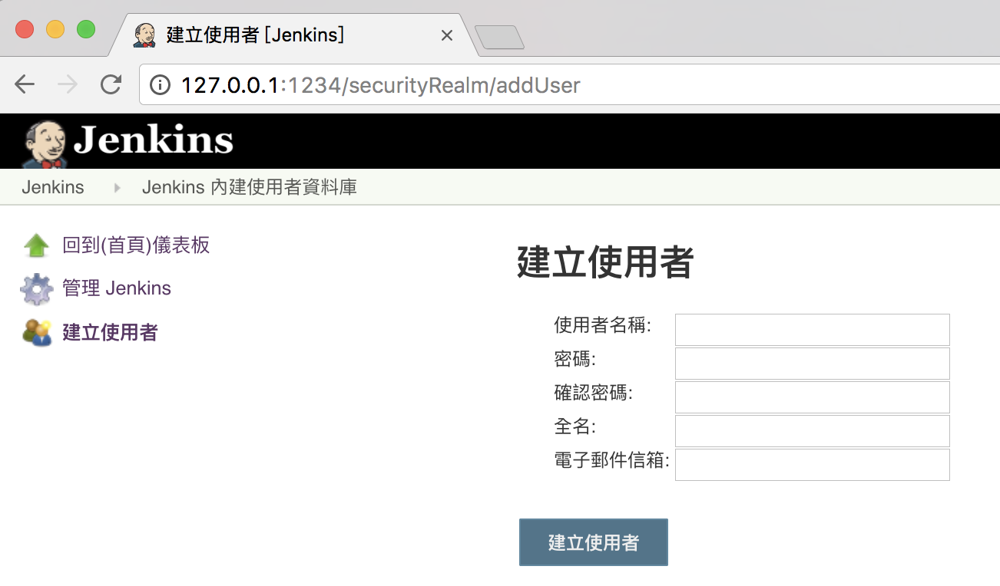
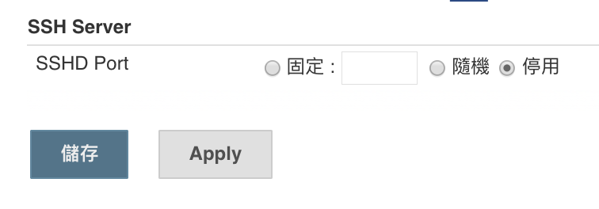
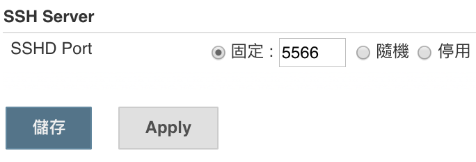

# Jenkins Scripting

在聽完 [Jenkins World 2017: Mastering the Jenkins Script Console](https://www.youtube.com/watch?v=qaUPESDcsGg) 的介紹後，想動手寫一些自己需要的東西，但實在不得其門而入。在 Script Console 有提供簡單的範例：


```groovy
println(Jenkins.instance.pluginManager.plugins)
```

即使知道能透過 `Jenkins.instance` 做到各種事情，但是由這出發，慢慢探索 OOO 的功能是怎麼做到的，似乎太沒效率。在這苦惱的同時，影片中印出所有 method 與[對應 Web UI 修改 github 使用者認證資料，再用 script 取得它，修改它給了我靈感](https://youtu.be/qaUPESDcsGg?t=19m48s)。

如同講者分享的，他也是透過研究 [GithubSecurityRealm](https://github.com/jenkinsci/github-oauth-plugin/blob/master/src/main/java/org/jenkinsci/plugins/GithubSecurityRealm.java#L128) 的原始碼才知道如何實作的，那我們應該也能由相似的路徑查出『OOO 的功能是怎麼做到的』既有的實作方法與相應要操作的物件。只是得解決一個問題，身為 Jenkins 不熟悉者要怎麼知道哪個功能，在哪個類別內呢？若能直接由 Web UI 的 source code 看出它對應的實作類別，那將會獲得很大的幫助。

## 觀察原始碼與 Web UI

於是下載了 Jenkins 的原始碼回來研究一下，發現檔案有點多。而且使用一種先前沒使用過的 Web Framework：[Stapler](http://stapler.kohsuke.org/)，依官網的副標它是：

>> Stapler HTTP request handling engine

透過 [What is Stapler?](http://stapler.kohsuke.org/what-is.html) 可以看到它實作概念，能將一棵物件樹自動將物件對應為 URL 體系：


翻開 [Jenkins 架構說明](https://wiki.jenkins.io/display/JENKINS/Architecture)，可以明確知道對應的 `root` 物件為何：

>> The singleton Hudson instance is bound to the context root (e.g. "/") URL, and the rest of the objects are bound according to their reachability from this root object.

而 `root` 物件的 `get` method 會被轉成 URL 裡的子目錄，不管是什麼形式由這個些簡單的資訊我們可以期待，由 URL 的路徑猜出某個 `getXXXX` 方法必存在，且對應到某個物件之上。這麼一來代表我們有機會快速由 URL 猜到對應的實作類別，或由 URL 配合 root 物件，也就是 `Hudson` instance 的 getter 找到對應的實作。

## 管理使用者



基於先前的方析，我們可以找點實際來練手。以剛安裝完 Jenkins 為例，常做的就是建立使用者。試著開始新增加使者的那頁，觀察一下網址：

```
http://127.0.0.1:1234/securityRealm/addUser
```

由於 `root` 是 `Jenkins`，所以可以猜這網址可能是這樣被呼叫的：

```
(jenkins).getSecurityRealm().addUser(...)
```

#### 關於 root 物件

雖然最初的文件說是 Hudson 類別的 instance，但它只是為了向下相容。在改名為 Jenkins 後早已改用 Jenkins 類別的 instance 了，另外可參考 [WebAppMain](https://github.com/jenkinsci/jenkins/blob/jenkins-2.87/core/src/main/java/hudson/WebAppMain.java#L239) 的實作，它確實在成功啟動 Jenkins 後，將 root 物件替換為 Jenkins 的 instance。

### 探索 Jenkins 物件

Jenkins 物件確實存在 [getSecurityRealm()](https://github.com/jenkinsci/jenkins/blob/jenkins-2.87/core/src/main/java/jenkins/model/Jenkins.java#L2542-L2544) 方法：

```java
    public SecurityRealm getSecurityRealm() {
        return securityRealm;
    }
```

但在 `SecurityRealm` 卻沒有 `addUser` 方法，表示 `addUser` 作為某個物件的方法去理解在這是錯誤的，另一點值得思考的是 `SecurityRealm` 是抽象類別，得有另一個具體實作的類別：

```java
public abstract class SecurityRealm extends AbstractDescribableImpl<SecurityRealm> implements ExtensionPoint {
    // ...
}
```

所以，我們可能直接在某個實作它的類別找到 `addUser` 方法，或是 `doAddUser` action，或是有個 `addUser.jelly` 的 view page。最終，在 [hudson/security/HudsonPrivateSecurityRealm/addUser.jelly](https://github.com/jenkinsci/jenkins/blob/jenkins-2.87/core/src/main/resources/hudson/security/HudsonPrivateSecurityRealm/addUser.jelly) 發現了 view page，它的內容極短：

```xml
<?jelly escape-by-default='true'?>
<j:jelly xmlns:j="jelly:core" xmlns:st="jelly:stapler" xmlns:d="jelly:define" xmlns:l="/lib/layout" xmlns:t="/lib/hudson" xmlns:f="/lib/form">
  <local:_entryFormPage host="${it}" title="${%Create User}" action="createAccountByAdmin" captcha="${false}" xmlns:local="/hudson/security/HudsonPrivateSecurityRealm" />
</j:jelly>
```

雖然，還未理解 jelly 的具體運作方式，但在 [Basic guide to Jelly usage in Jenkins](https://wiki.jenkins.io/display/JENKINS/Basic+guide+to+Jelly+usage+in+Jenkins)
 中有教到，變數 `it` 即為 URL 對應的物件，配合先前所知的規則，我們獲得的新線索會是：

 ```java
 (hudsonPrivateSecurityRealm).doCreateAccountByAdmin(...)
 ```

經追蹤後，能找到對應的 [doCreateAccountByAdmin](https://github.com/jenkinsci/jenkins/blob/jenkins-2.87/core/src/main/java/hudson/security/HudsonPrivateSecurityRealm.java#L271-L274) 方法，最後獲得實際[註冊使用者](https://github.com/jenkinsci/jenkins/blob/jenkins-2.87/core/src/main/java/hudson/security/HudsonPrivateSecurityRealm.java#L371-L384)的做法：

```java
// register the user
User user = createAccount(si.username,si.password1);
user.setFullName(si.fullname);
if(isMailerPluginPresent()) {
    try {
        // legacy hack. mail support has moved out to a separate plugin
        Class<?> up = Jenkins.getInstance().pluginManager.uberClassLoader.loadClass("hudson.tasks.Mailer$UserProperty");
        Constructor<?> c = up.getDeclaredConstructor(String.class);
        user.addProperty((UserProperty)c.newInstance(si.email));
    } catch (ReflectiveOperationException e) {
        throw new RuntimeException(e);
    }
}
user.save();
```

其中 `createAccount` 方法單純只是呼叫 User 的靜態方法：

```java
/**
* Creates a new user account by registering a password to the user.
*/
public User createAccount(String userName, String password) throws IOException {
    User user = User.getById(userName, true);
    user.addProperty(Details.fromPlainPassword(password));
    return user;
}
```

經過這樣由 Web UI 追蹤實作方式的過程，我們學會了如何註冊使用者。這是單純研究 Jenkins 及其關聯物件無法直接知道的。

#### 反思 URL 最後一節

重新再回頭看 trace 的流程，也許該把 URL 最後一節的部分，優先當 view page 尋找其 `.jelly` 應該是較有效率的。


## 設定全域安全性



挑戰完使用者相關的頁面後，能再挑不同的頁面來試試。例如：設定 SSHD 連線 port。它被放在：

```
http://127.0.0.1:1234/configureSecurity/
```

所以，它可能是 root 物件 Jenkins 下的 `getconfigureSecurity()` 或是同 package 下的 `configureSecurity.jelly`。不過，找了半天，二者都不存在。動用 IDE 的文全檢索，發現它是在 [GlobalSecurityConfiguration](https://github.com/jenkinsci/jenkins/blob/jenkins-2.87/core/src/main/java/hudson/security/GlobalSecurityConfiguration.java#L184) 類別內：

```java
@Override
public String getUrlName() {
    return "configureSecurity";
}
```

這看起來就妙了，它顯然不是單純運用 Stapler 現有機制分派的頁面。稍為看了一會兒，它似乎是 Jenkins 內的 Service Discovery 機制，要追下去就偏離了尋找『OOO 的功能是怎麼做到的』首要目標。

那麼試著在 `GlobalSecurityConfiguration` 物件同 package 下詢找 view page，它是沒有 jelly 的，這又是另一個新奇的發現，但它有 .groovy：


可以在其它的 Jenkins 開發文件找到是能以 groovy 實作 view page 的，雖然它沒說明如何達成。但看起來確實不難理解，原先的 jelly 就像 xml 格式了，用 groovy 來產生 xml 也不算新奇的事，直接看[GlobalSecurityConfiguration 的 view page 實作](https://github.com/jenkinsci/jenkins/blob/jenkins-2.87/core/src/main/resources/jenkins/tools/GlobalToolConfiguration/index.groovy)：

```groovy
package jenkins.tools.GlobalToolConfiguration

import hudson.Functions
import hudson.model.Descriptor

def f=namespace(lib.FormTagLib)
def l=namespace(lib.LayoutTagLib)
def st=namespace("jelly:stapler")

l.layout(norefresh:true, permission:app.ADMINISTER, title:my.displayName) {
    l.side_panel {
        l.tasks {
            l.task(icon:"icon-up icon-md", href:rootURL+'/', title:_("Back to Dashboard"))
            l.task(icon:"icon-setting icon-md", href:"${rootURL}/manage", title:_("Manage Jenkins"))
        }
    }
    l.main_panel {
        h1 {
            l.icon(class: 'icon-setting icon-xlg')
            // TODO more appropriate icon
            text(my.displayName)
        }

        p()
        div(class:"behavior-loading", _("LOADING"))

        f.form(method:"post",name:"config",action:"configure") {
            Functions.getSortedDescriptorsForGlobalConfig(my.FILTER).each { Descriptor descriptor ->
                set("descriptor",descriptor)
                set("instance",descriptor)
                f.rowSet(name:descriptor.jsonSafeClassName) {
                    st.include(from:descriptor, page:descriptor.globalConfigPage)
                }
            }

            f.bottomButtonBar {
                f.submit(value:_("Save"))
                f.apply(value:_("Apply"))
            }
        }

        st.adjunct(includes: "lib.form.confirm")
    }
}
```

依先前在 jelly 的經驗，我們得先找到 `it`，因為它是操作的物件本身。但我們可以觀察到，此頁相對於 `it` 的功能是 `my`，我想這是因為 groovy closure 的 `it` 有它既有的用途，所以改用 `my` 來取得即有的物件，那麼我們可以開始解讀在此頁的設定是如何來的：

```groovy
Functions.getSortedDescriptorsForGlobalConfig(my.FILTER).each { Descriptor descriptor ->
    set("descriptor",descriptor)
    set("instance",descriptor)
    f.rowSet(name:descriptor.jsonSafeClassName) {
        st.include(from:descriptor, page:descriptor.globalConfigPage)
    }
}
```

它利用 `GlobalSecurityConfiguration` 內的 `FILTER` 找出需要的 `Descriptor` 後顯示在頁面上，我們需要的 SSHD 的部分，應該也在其中。而最終會回到 `GlobalSecurityConfiguration` 被處理，在它內部應提供 `doXXXXX` 的 action method，查看原始碼它只有唯一的 [doConfigure](https://github.com/jenkinsci/jenkins/blob/jenkins-2.87/core/src/main/java/hudson/security/GlobalSecurityConfiguration.java#L97)：

```java
@RequirePOST
public synchronized void doConfigure(StaplerRequest req, StaplerResponse rsp) throws IOException, ServletException, FormException {
    // for compatibility reasons, the actual value is stored in Jenkins
    BulkChange bc = new BulkChange(Jenkins.getInstance());
    try{
        boolean result = configure(req, req.getSubmittedForm());
        LOGGER.log(Level.FINE, "security saved: "+result);
        Jenkins.getInstance().save();
        FormApply.success(req.getContextPath()+"/manage").generateResponse(req, rsp, null);
    } finally {
        bc.commit();
    }
}
```

略過其它看起來不重要的部分，最終是要求 `Descriptor` 更新自己：

```java
private boolean configureDescriptor(StaplerRequest req, JSONObject json, Descriptor<?> d) throws FormException {
    // collapse the structure to remain backward compatible with the JSON structure before 1.
    String name = d.getJsonSafeClassName();
    JSONObject js = json.has(name) ? json.getJSONObject(name) : new JSONObject(); // if it doesn't have the property, the method returns invalid null object.
    json.putAll(js);
    return d.configure(req, js);
}    
```

那麼我們得知道，哪一個 Descriptor 是能用改 SSHD 的 port 的，試著用一樣的邏輯在 Script Console 印出來觀察一下：

```groovy
Functions.getSortedDescriptorsForGlobalConfig(hudson.security.GlobalSecurityConfiguration.FILTER).each { Descriptor descriptor ->
  println "Name: ${descriptor.displayName}, id: ${descriptor.id}"
}
```

結果如下：

```
Name: GlobalCrumbIssuerConfiguration, id: hudson.security.csrf.GlobalCrumbIssuerConfiguration
Name: CLI, id: jenkins.CLI
Name: DownloadSettings, id: jenkins.model.DownloadSettings
Name: QueueItemAuthenticatorConfiguration, id: jenkins.security.QueueItemAuthenticatorConfiguration
Name: UpdateSiteWarningsConfiguration, id: jenkins.security.UpdateSiteWarningsConfiguration
Name: MasterKillSwitchConfiguration, id: jenkins.security.s2m.MasterKillSwitchConfiguration
Name: SSHD, id: org.jenkinsci.main.modules.sshd.SSHD
Result: [hudson.security.csrf.GlobalCrumbIssuerConfiguration@50155648, jenkins.CLI@1844b419, jenkins.model.DownloadSettings@23681065, jenkins.security.QueueItemAuthenticatorConfiguration@10a54860, jenkins.security.UpdateSiteWarningsConfiguration@6a78fb2a, jenkins.security.s2m.MasterKillSwitchConfiguration@57a16e00, org.jenkinsci.main.modules.sshd.SSHD@3429b7a9]
```

由於 `org.jenkinsci.main.modules.sshd.SSHD` 是相依的 library，不是原始碼型式在專案內的，我們仍可 google 到它的程式看一下 [configure](https://github.com/jenkinsci/sshd-module/blob/master/src/main/java/org/jenkinsci/main/modules/sshd/SSHD.java#L193) 在做些什麼：

```java
@Override
public boolean configure(StaplerRequest req, JSONObject json) throws FormException {
    setPort(new ServerTcpPort(json.getJSONObject("port")).getPort());
    return true;
}
```

並且知道透過呼叫 `setPort` 就能完成目標了：

```java
/**
    * Set the port number to be used.
    *
    * @param port -1 to disable this, 0 to run with a random port, otherwise the port number.
    */
public void setPort(int port) {
    if (this.port!=port) {
        this.port = port;
        Timer.get().submit(new Runnable() {
            public void run() {
                restart();
            }
        });
        save();
    }
}
```

另外，可以發現 SSHD 也是一個 `Extension`，所以能直接使用 Service Discovery 機制取得這個物件，以它內部的實作就提供了這樣的方法：

```java
public static SSHD get() {
    return ExtensionList.lookup(GlobalConfiguration.class).get(SSHD.class);
}
```

所以，要達成目標需要的程式碼應為：

```java
org.jenkinsci.main.modules.sshd.SSHD.get().setPort(5566);
```

在 Script Console 執行完後，重新設定全域安全設定的那一頁：



完全不敢相信，竟然這麼簡單就成功啟用 sshd：

```
qty:~ qrtt1$ telnet 127.0.0.1 5566
Trying 127.0.0.1...
Connected to localhost.
Escape character is '^]'.
SSH-2.0-SSHD-CORE-1.6.0
^]
telnet> q
Connection closed.
qty:~ qrtt1$
```

## 結語

雖然，我們沒有真正掌握 Jenkins Web UI 的技術，但至少能開始 trace 原始碼，並獲得有用的資訊了。（雖然，過程累了點），但都找到方法後可以直接用 Jenkins Script 做出各式各樣的設定變更。

PS. 其它範例可見 [Recipe](Recipe.md)
