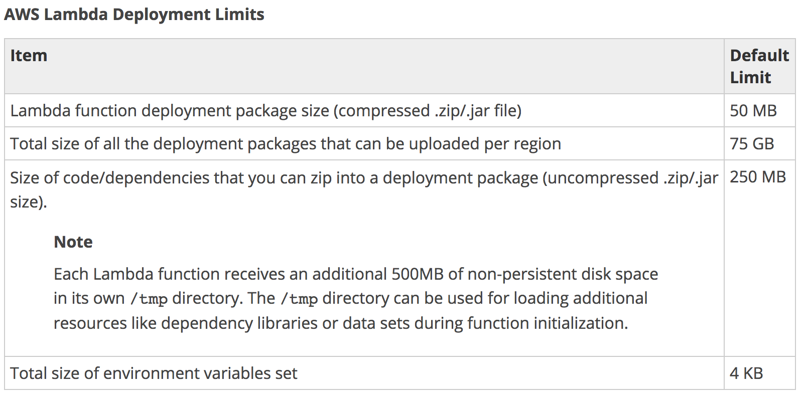

# AWS Lambda Python Notes

最近剛好用到 AWS Lambda 上跑 Python + pandas 的情境，寫一下 library 準備的 tips


## 準備相依 library

因為 pandas 這類科學計算用的 library，大多包有 native library 在裡面。在官方手冊上有教如何準備 library。
不過目前環境是 linux x86\_64 的機器，那我們其實可以簡單地運用 docker 來準備它：

```
mkdir -p data
docker run -it --rm -v `pwd`/data:/data -w /data python:3 pip install pandas -t /data
```

上面的指令其實就是，建立一個 data 資料夾，並在 docker 啟動時 mount 進去而已。再指定 pip 要裝到 data 資料夾內，執行完後你可以發現它抓的版本就是給 linux 使用的:

```
qty:data qrtt1$ find . -name "*.so" |head
./numpy/.libs/libopenblasp-r0-39a31c03.2.18.so
./numpy/core/_dummy.cpython-36m-x86_64-linux-gnu.so
./numpy/core/multiarray.cpython-36m-x86_64-linux-gnu.so
./numpy/core/multiarray_tests.cpython-36m-x86_64-linux-gnu.so
./numpy/core/operand_flag_tests.cpython-36m-x86_64-linux-gnu.so
./numpy/core/struct_ufunc_test.cpython-36m-x86_64-linux-gnu.so
./numpy/core/test_rational.cpython-36m-x86_64-linux-gnu.so
./numpy/core/umath.cpython-36m-x86_64-linux-gnu.so
./numpy/core/umath_tests.cpython-36m-x86_64-linux-gnu.so
./numpy/fft/fftpack_lite.cpython-36m-x86_64-linux-gnu.so
```

總大小其實蠻巨大的，要注意一下它不可以超過 [AWS Lambda Limits](https://docs.aws.amazon.com/lambda/latest/dg/limits.html) 的限制：



```
qty:data qrtt1$ du -h -s
170M    .
```

## 超出限制怎麼辦

若是 zip 檔超過限制，時則有另一招可以用來 work around：

* python 的 module search path 是 runtime 可以變更的
* 將超出限制的部分，放在 s3 上，下載回來解壓縮，並加入 module search path (也就是 sys.path)
* aws lambda 的 `/tmp` 內是可以寫入的空間

以下是以 pandas library 實驗的程式：

```python
import os, sys, time
import boto3
import logging

__bucket_name = 'the_bucket_you_put_library'

logging.basicConfig()
logger = logging.getLogger('perf')
logger.setLevel(logging.INFO)

def stopwatch(func):
    def with_logging(*args, **kwargs):
        start_time = time.time()
        try:
            return func(*args, **kwargs)
        finally:
            end_time = time.time()
            logger.info("func[ {:16s} ] :: {:.3f}".format(func.__name__, end_time - start_time))
            pass

    return with_logging

def dir(p, filename = None):
    target = os.path.join('/tmp/extra', p)
    if not os.path.exists(target):
        os.makedirs(target)
    if filename:
        return "{}/{}".format(target, filename)
    else:
        return target

@stopwatch
def prepare_dir():
    
    s3 = boto3.resource('s3')
    if not os.path.exists(dir('downloads', 'pandas.zip')):
        s3.Object(__bucket_name, 'pandas.zip').download_file(dir('downloads', 'pandas.zip'))
        cmd = "bash -c 'cd {}; unzip {} -d {} '".format(dir('libs'), dir('downloads', 'pandas.zip'), dir('libs'))
        os.system(cmd)
    

def lambda_handler(event, context):
    prepare_dir()
    sys.path.append(dir('libs'))
    
    import pandas as pd
    print(pd.__doc__)
   
    return 'Hello from Lambda'

```

結果為：

* 需要約 30 秒準備 library，其中 6 秒大約是由 s3 下載的時間
* 雖然需要很久，但至少能將 library 放進去了

```
Response:
"Hello from Lambda"

Request ID:
"75f55322-2bef-11e8-823a-fb6239c1b277"

Function Logs:
START RequestId: 75f55322-2bef-11e8-823a-fb6239c1b277 Version: $LATEST
[INFO]	2018-03-20T03:34:01.587Z	75f55322-2bef-11e8-823a-fb6239c1b277	func[ prepare_dir      ] :: 30.103

pandas - a powerful data analysis and manipulation library for Python
=====================================================================

**pandas** is a Python package providing fast, flexible, and expressive data
structures designed to make working with "relational" or "labeled" data both
easy and intuitive. It aims to be the fundamental high-level building block for
doing practical, **real world** data analysis in Python. Additionally, it has
the broader goal of becoming **the most powerful and flexible open source data
analysis / manipulation tool available in any language**. It is already well on
its way toward this goal.

Main Features
-------------
Here are just a few of the things that pandas does well:

  - Easy handling of missing data in floating point as well as non-floating
    point data
  - Size mutability: columns can be inserted and deleted from DataFrame and
    higher dimensional objects
  - Automatic and explicit data alignment: objects can  be explicitly aligned
    to a set of labels, or the user can simply ignore the labels and let
    `Series`, `DataFrame`, etc. automatically align the data for you in
    computations
  - Powerful, flexible group by functionality to perform split-apply-combine
    operations on data sets, for both aggregating and transforming data
  - Make it easy to convert ragged, differently-indexed data in other Python
    and NumPy data structures into DataFrame objects
  - Intelligent label-based slicing, fancy indexing, and subsetting of large
    data sets
  - Intuitive merging and joining data sets
  - Flexible reshaping and pivoting of data sets
  - Hierarchical labeling of axes (possible to have multiple labels per tick)
  - Robust IO tools for loading data from flat files (CSV and delimited),
    Excel files, databases, and saving/loading data from the ultrafast HDF5
    format
  - Time series-specific functionality: date range generation and frequency
    conversion, moving window statistics, moving window linear regressions,
    date shifting and lagging, etc.

END RequestId: 75f55322-2bef-11e8-823a-fb6239c1b277
REPORT RequestId: 75f55322-2bef-11e8-823a-fb6239c1b277	Duration: 34092.77 ms	Billed Duration: 34100 ms 	Memory Size: 128 MB	Max Memory Used: 128 MB	
```

## Work Around 應用建議

* 由於解壓縮的時間會很久，最好是能避勉使用 Work Around
* 若真的需要 Work Around，那僅將超出的範圍使用 Work Around 以獲得最佳的啟動速度